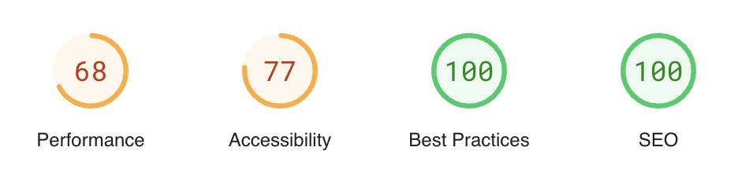

# Quasar Minimalist Design 

## Proudly serving over 7+ happy customers and counting! 🚀🚀🚀

    

In the world of web design and development, a minimalist approach has gained a lot of popularity in recent years.
Minimalist design focuses on creating an aesthetic that is clean, uncluttered, and simple. This design philosophy is all
about making the most of the essentials and doing away with the superfluous. Quasar Minimalist Design, an admin
template, is a perfect example of this philosophy.

Quasar Minimalist Design is a premium admin template that offers a range of features and functionalities. It is designed
to cater to the needs of businesses and organisations that require a user-friendly and efficient dashboard. The template
includes a range of components, including a dashboard, customers, library, settings, calendar, and login page.

Check out the website at https://quasar-minimalist-design.netlify.app

## If you're interested in purchasing this template, please visit my sponsorship page(Sponsor Me). To gain access to the code, you'll need to [sponsor me](https://github.com/sponsors/pratik227) for $49 per month (one-time payment).

## Dashboard

## Dashboard 2

## Orders 

## Customers

## Customers Add

## Library

## Settings

## Calendar

## Login

In conclusion, Quasar Minimalist Design is a premium admin template that is designed to cater to the needs of businesses
and organisation's. It includes a range of components, including a dashboard, customers, library, settings, calendar,
and login page. The template is designed with a minimalist philosophy in mind, which means that it is clean,
uncluttered, and simple.

If you are looking for an admin template that is both user-friendly and efficient, Quasar Minimalist Design is
definitely worth considering.

## Changelog

## 7.05.2024

1. Added new Dashboard
2. New page for recent Orders

